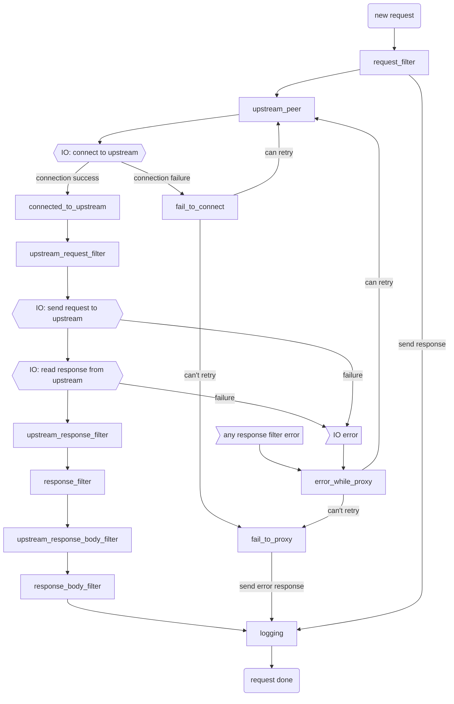

# Pingora Internals

(Special thanks to [James Munns](https://github.com/jamesmunns) for writing this section)


## Starting the `Server`

The pingora system starts by spawning a *server*. The server is responsible for starting *services*, and listening for termination events.

```
                               ┌───────────┐
                    ┌─────────>│  Service  │
                    │          └───────────┘
┌────────┐          │          ┌───────────┐
│ Server │──Spawns──┼─────────>│  Service  │
└────────┘          │          └───────────┘
                    │          ┌───────────┐
                    └─────────>│  Service  │
                               └───────────┘
```

After spawning the *services*, the server continues to listen to a termination event, which it will propagate to the created services.

## Services

*Services* are entities that handle listening to given sockets, and perform the core functionality. A *service* is tied to a particular protocol and set of options.

> NOTE: there are also "background" services, which just do *stuff*, and aren't necessarily listening to a socket. For now we're just talking about listener services.

Each service has its own threadpool/tokio runtime, with a number of threads based on the configured value. Worker threads are not shared cross-service. Service runtime threadpools may be work-stealing (tokio-default), or non-work-stealing (N isolated single threaded runtimes).

```
┌─────────────────────────┐
│ ┌─────────────────────┐ │
│ │┌─────────┬─────────┐│ │
│ ││  Conn   │  Conn   ││ │
│ │├─────────┼─────────┤│ │
│ ││Endpoint │Endpoint ││ │
│ │├─────────┴─────────┤│ │
│ ││     Listeners     ││ │
│ │├─────────┬─────────┤│ │
│ ││ Worker  │ Worker  ││ │
│ ││ Thread  │ Thread  ││ │
│ │├─────────┴─────────┤│ │
│ ││  Tokio Executor   ││ │
│ │└───────────────────┘│ │
│ └─────────────────────┘ │
│ ┌───────┐               │
└─┤Service├───────────────┘
  └───────┘
```

## Service Listeners

At startup, each Service is assigned a set of downstream endpoints that they listen to. A single service may listen to more than one endpoint. The Server also passes along any relevant configuration, including TLS settings if relevant.

These endpoints are converted into listening sockets, called `TransportStack`s. Each `TransportStack` is assigned to an async task within that service's executor.

```
                                 ┌───────────────────┐
                                 │┌─────────────────┐│    ┌ ─ ─ ─ ─ ─ ─ ─ ─ ─ ─ ─ ┐  ┌ ─ ─ ─ ─ ─ ─ ─ ─ ─ ─ ─
 ┌─────────┐                     ││ TransportStack  ││                                ┌────────────────────┐│
┌┤Listeners├────────┐            ││                 ││    │                       │  ││                    │
│└─────────┘        │            ││ (Listener, TLS  │├──────spawn(run_endpoint())────>│ Service<ServerApp> ││
│┌─────────────────┐│            ││    Acceptor,    ││    │                       │  ││                    │
││    Endpoint     ││            ││   UpgradeFDs)   ││                                └────────────────────┘│
││   addr/ports    ││            │├─────────────────┤│    │                       │  │
││ + TLS Settings  ││            ││ TransportStack  ││                                ┌────────────────────┐│
│├─────────────────┤│            ││                 ││    │                       │  ││                    │
││    Endpoint     ││──build()─> ││ (Listener, TLS  │├──────spawn(run_endpoint())────>│ Service<ServerApp> ││
││   addr/ports    ││            ││    Acceptor,    ││    │                       │  ││                    │
││ + TLS Settings  ││            ││   UpgradeFDs)   ││                                └────────────────────┘│
│├─────────────────┤│            │├─────────────────┤│    │                       │  │
││    Endpoint     ││            ││ TransportStack  ││                                ┌────────────────────┐│
││   addr/ports    ││            ││                 ││    │                       │  ││                    │
││ + TLS Settings  ││            ││ (Listener, TLS  │├──────spawn(run_endpoint())────>│ Service<ServerApp> ││
│└─────────────────┘│            ││    Acceptor,    ││    │                       │  ││                    │
└───────────────────┘            ││   UpgradeFDs)   ││                                └────────────────────┘│
                                 │└─────────────────┘│    │ ┌───────────────┐     │  │ ┌──────────────┐
                                 └───────────────────┘     ─│start_service()│─ ─ ─    ─│ Worker Tasks ├ ─ ─ ┘
                                                            └───────────────┘          └──────────────┘
```

## Downstream connection lifecycle

Each service processes incoming connections by spawning a task-per-connection. These connections are held open
as long as there are new events to be handled.

```
                                  ┌ ─ ─ ─ ─ ─ ─ ─ ─ ─ ─ ─ ─ ─ ─ ─ ─ ─ ─ ─ ─ ─ ─ ─ ─ ─ ─ ─ ─ ─ ─ ─ ─ ─ ─ ─ ─ ─ ─ ─ ─ ─ ┐

                                  │  ┌───────────────┐   ┌────────────────┐   ┌─────────────────┐    ┌─────────────┐  │
┌────────────────────┐               │ UninitStream  │   │    Service     │   │       App       │    │  Task Ends  │
│                    │            │  │ ::handshake() │──>│::handle_event()│──>│ ::process_new() │──┬>│             │  │
│ Service<ServerApp> │──spawn()──>   └───────────────┘   └────────────────┘   └─────────────────┘  │ └─────────────┘
│                    │            │                                                    ▲           │                  │
└────────────────────┘                                                                 │         while
                                  │                                                    └─────────reuse                │
                                     ┌───────────────────────────┐
                                  └ ─│  Task on Service Runtime  │─ ─ ─ ─ ─ ─ ─ ─ ─ ─ ─ ─ ─ ─ ─ ─ ─ ─ ─ ─ ─ ─ ─ ─ ─ ─ ┘
                                     └───────────────────────────┘
```

## What is a proxy then?

Interestingly, the `pingora` `Server` itself has no particular notion of a Proxy.

Instead, it only thinks in terms of `Service`s, which are expected to contain a particular implementor of the `ServiceApp` trait.

For example, this is how an `HttpProxy` struct, from the `pingora-proxy` crate, "becomes" a `Service` spawned by the `Server`:

```
┌─────────────┐
│  HttpProxy  │
│  (struct)   │
└─────────────┘
       │
   implements   ┌─────────────┐
       │        │HttpServerApp│
       └───────>│   (trait)   │
                └─────────────┘
                       │
                   implements   ┌─────────────┐
                       │        │  ServerApp  │
                       └───────>│   (trait)   │
                                └─────────────┘
                                       │
                                   contained    ┌─────────────────────┐
                                     within     │                     │
                                       └───────>│ Service<ServiceApp> │
                                                │                     │
                                                └─────────────────────┘
```

Different functionalities and helpers are provided at different layers in this representation.

```
┌─────────────┐        ┌──────────────────────────────────────┐
│  HttpProxy  │        │Handles high level Proxying workflow, │
│  (struct)   │─ ─ ─ ─ │   customizable via ProxyHttp trait   │
└──────┬──────┘        └──────────────────────────────────────┘
       │
┌──────▼──────┐        ┌──────────────────────────────────────┐
│HttpServerApp│        │ Handles selection of H1 vs H2 stream │
│   (trait)   │─ ─ ─ ─ │     handling, incl H2 handshake      │
└──────┬──────┘        └──────────────────────────────────────┘
       │
┌──────▼──────┐        ┌──────────────────────────────────────┐
│  ServerApp  │        │ Handles dispatching of App instances │
│   (trait)   │─ ─ ─ ─ │   as individual tasks, per Session   │
└──────┬──────┘        └──────────────────────────────────────┘
       │
┌──────▼──────┐        ┌──────────────────────────────────────┐
│ Service<A>  │        │ Handles dispatching of App instances │
│  (struct)   │─ ─ ─ ─ │  as individual tasks, per Listener   │
└─────────────┘        └──────────────────────────────────────┘
```

The `HttpProxy` struct handles the high level workflow of proxying an HTTP connection

It uses the `ProxyHttp` (note the flipped wording order!) **trait** to allow customization
at each of the following steps (note: taken from [the phase chart](./phase_chart.md) doc):



## Zooming out

Before we zoom in, it's probably good to zoom out and remind ourselves how
a proxy generally works:

```
┌────────────┐          ┌─────────────┐         ┌────────────┐
│ Downstream │          │    Proxy    │         │  Upstream  │
│   Client   │─────────>│             │────────>│   Server   │
└────────────┘          └─────────────┘         └────────────┘
```

The proxy will be taking connections from the **Downstream** client, and (if
everything goes right), establishing a connection with the appropriate
**Upstream** server. This selected upstream server is referred to as
the **Peer**.

Once the connection is established, the Downstream and Upstream can communicate
bidirectionally.

So far, the discussion of Server, Services, and Listeners have focused on the LEFT
half of this diagram, handling incoming Downstream connections, and getting it TO
the proxy component.

Next, we'll look at the RIGHT half of this diagram, connecting to Upstreams.

## Managing the Upstream

Connections to Upstream Peers are made through `Connector`s. This is not a specific type or trait, but more
of a "style".

Connectors are responsible for a few things:

* Establishing a connection with a Peer
* Maintaining a connection pool with the Peer, allowing for connection reuse across:
    * Multiple requests from a single downstream client
    * Multiple requests from different downstream clients
* Measuring health of connections, for connections like H2, which perform regular pings
* Handling protocols with multiple poolable layers, like H2
* Caching, if relevant to the protocol and enabled
* Compression, if relevant to the protocol and enabled

Now in context, we can see how each end of the Proxy is handled:

```
┌────────────┐          ┌─────────────┐         ┌────────────┐
│ Downstream │       ┌ ─│─   Proxy  ┌ ┼ ─       │  Upstream  │
│   Client   │─────────>│ │           │──┼─────>│   Server   │
└────────────┘       │  └───────────┼─┘         └────────────┘
                      ─ ─ ┘          ─ ─ ┘
                        ▲              ▲
                     ┌──┘              └──┐
                     │                    │
                ┌ ─ ─ ─ ─ ┐         ┌ ─ ─ ─ ─ ─
                 Listeners           Connectors│
                └ ─ ─ ─ ─ ┘         └ ─ ─ ─ ─ ─
```

## What about multiple peers?

`Connectors` only handle the connection to a single peer, so selecting one of potentially multiple Peers
is actually handled one level up, in the `upstream_peer()` method of the `ProxyHttp` trait.
