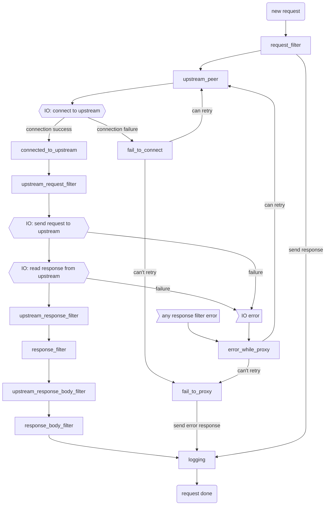

# Life of a request: pingora-proxy phases and filters

## Intro
The pingora-proxy HTTP proxy framework supports highly programmable proxy behaviors. This is done by allowing users to inject custom logic into different phases (stages) in the life of a request.

## Life of a proxied HTTP request
1. The life of a proxied HTTP request starts when the proxy reads the request header from the **downstream** (i.e., the client).
2. Then, the proxy connects to the **upstream** (i.e., the remote server). This step is skipped if there is a previously established [connection to reuse](pooling.md).
3. The proxy then sends the request header to the upstream.
4. Once the request header is sent, the proxy enters a duplex mode, which simultaneously proxies:
    a. upstream response (both header and body) to the downstream, and
    b. downstream request body to upstream (if any).
5. Once the entire request/response finishes, the life of the request is ended. All resources are released. The downstream connections and the upstream connections are recycled to be reused if applicable.

## Pingora-proxy phases and filters
Pingora-proxy allows users to insert arbitrary logic into the life of a request.

### General filter usage guidelines
* Most filters return a [`pingora_error::Result<_>`](errors.md). When the returned value is `Result::Err`, `fail_to_proxy()` will be called and the request will be terminated.
* Most filters are async functions, which allows other async operations such as IO to be performed within the filters.
* A per-request `CTX` object can be defined to share states across the filters of the same request. All filters have mutable access to this object.
* Most filters are optional.
* The reason both `upstream_response_*_filter()` and `response_*_filter()` exist is for HTTP caching integration reasons (still WIP).

### `request_filter()`
This is the first phase of every request.

This phase is usually for validating request inputs, rate limiting, and initializing context.

### `proxy_upstream_filter()`
This phase determines if we should continue to the upstream to serve a response. If we short-circuit, a 502 is returned by default, but a different response can be implemented.

This phase returns a boolean determining if we should continue to the upstream or error.

### `upstream_peer()`
This phase decides which upstream to connect to (e.g. with DNS lookup and hashing/round-robin), and how to connect to it.

This phase returns a `Peer` that defines the upstream to connect to. Implementing this phase is **required**.

### `connected_to_upstream()`
This phase is executed when upstream is successfully connected.

Usually this phase is for logging purposes. Connection info such as RTT and upstream TLS ciphers are reported in this phase.

### `fail_to_connect()`
The counterpart of `connected_to_upstream()`. This phase is called if an error is encountered when connecting to upstream.

In this phase users can report the error in Sentry/Prometheus/error log. Users can also decide if the error is retry-able.

If the error is retry-able, `upstream_peer()` will be called again, in which case the user can decide whether to retry the same upstream or failover to a secondary one.

If the error is not retry-able, the request will end.

### `upstream_request_filter()`
This phase is to modify requests before sending to upstream.

### `upstream_response_filter()/upstream_response_body_filter()/upstream_response_trailer_filter()`
This phase is triggered after an upstream response header/body/trailer is received.

This phase is to modify or process response headers, body, or trailers before sending to downstream. Note that this phase is called _prior_ to HTTP caching and therefore any changes made here will affect the response stored in the HTTP cache.

### `response_filter()/response_body_filter()/response_trailer_filter()`
This phase is triggered after a response header/body/trailer is ready to send to downstream.

This phase is to modify them before sending to downstream.

### `error_while_proxy()`
This phase is triggered during proxy errors to upstream, this is after the connection is established.

This phase may decide to retry a request if the connection was re-used and the HTTP method is idempotent.

### `fail_to_proxy()`
This phase is called whenever an error is encounter during any of the phases above.

This phase is usually for error logging and error reporting to downstream.

### `logging()`
This is the last phase that runs after the request is finished (or errors) and before any of its resources are released. Every request will end up in this final phase.

This phase is usually for logging and post request cleanup.

### `request_summary()`
This is not a phase, but a commonly used callback.

Every error that reaches `fail_to_proxy()` will be automatically logged in the error log. `request_summary()` will be called to dump the info regarding the request when logging the error.

This callback returns a string which allows users to customize what info to dump in the error log to help track and debug the failures.

### `suppress_error_log()`
This is also not a phase, but another callback.

`fail_to_proxy()` errors are automatically logged in the error log, but users may not be interested in every error. For example, downstream errors are logged if the client disconnects early, but these errors can become noisy if users are mainly interested in observing upstream issues. This callback can inspect the error and returns true or false. If true, the error will not be written to the log.

### Cache filters

To be documented
