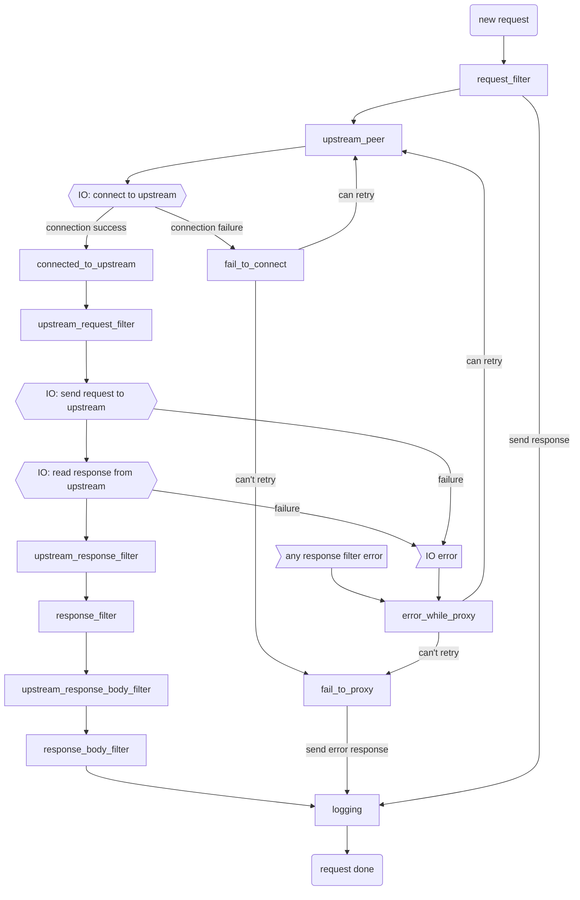

Pingora proxy phases without caching

```mermaid
 graph TD;
    start("new request")-->request_filter;
    request_filter-->upstream_peer;

    upstream_peer-->Connect{{IO: connect to upstream}};

    Connect--connection success-->connected_to_upstream;
    Connect--connection failure-->fail_to_connect;

    connected_to_upstream-->upstream_request_filter;
    upstream_request_filter --> SendReq{{IO: send request to upstream}};
    SendReq-->RecvResp{{IO: read response from upstream}};
    RecvResp-->upstream_response_filter-->response_filter-->upstream_response_body_filter-->response_body_filter-->logging-->endreq("request done");

    fail_to_connect --can retry-->upstream_peer;
    fail_to_connect --can't retry-->fail_to_proxy--send error response-->logging;

    RecvResp--failure-->IOFailure;
    SendReq--failure-->IOFailure;
    error_while_proxy--can retry-->upstream_peer;
    error_while_proxy--can't retry-->fail_to_proxy;

    request_filter --send response-->logging


    Error>any response filter error]-->error_while_proxy
    IOFailure>IO error]-->error_while_proxy
```