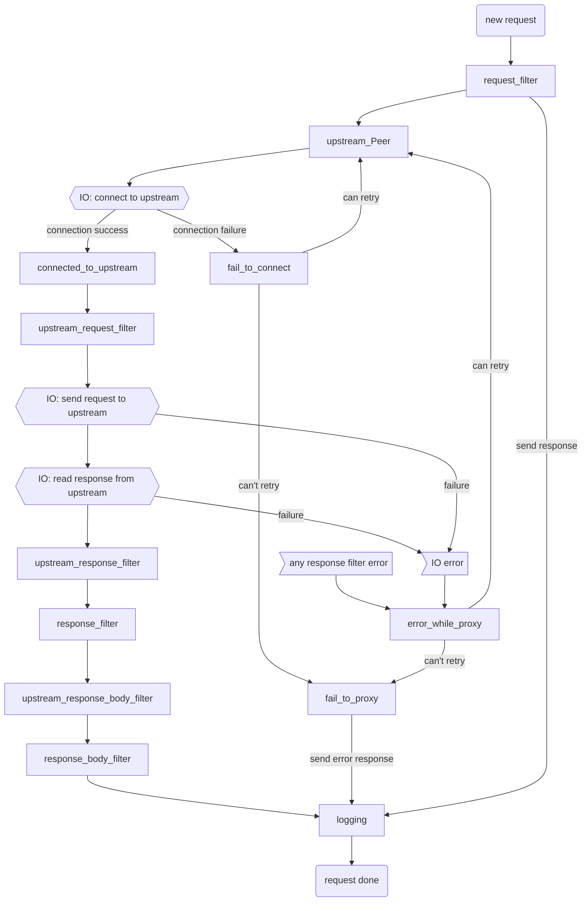

# Pingora Internals

（特别感谢 [James Munns](https://github.com/jamesmunns) 撰写此部分）

## 启动 `Server`

`Pingora` 系统通过生成一个 *Server* 来启动。服务器负责启动一个 *Service* 用于监听停止信号。

```
                               ┌───────────┐
                    ┌─────────>│  Service  │
                    │          └───────────┘
┌────────┐          │          ┌───────────┐
│ Server │──Spawns──┼─────────>│  Service  │
└────────┘          │          └───────────┘
                    │          ┌───────────┐
                    └─────────>│  Service  │
                               └───────────┘
```

在生成 *Server* 后，`Service` 继续监听终止事件，并将其传播给创建的 Server。

## Server

*Server* 是负责监听给定`Socket`并执行核心功能。每个 *Server* 都关联一组选项和指定的协议。

> 注意：还有 "后台" 服务，只执行 *Work*，不一定监听`Socket`。目前我们只讨论监听器服务。

每个服务都有自己的 `threadpool/tokio` 运行时，其中包含的线程数量根据配置的值而定。工作线程不会跨服务共享。服务运行时的线程池线程运行分为窃取模式（tokio 默认）或非窃取模式（N 个独立的单线程运行时）。

```
┌─────────────────────────┐
│ ┌─────────────────────┐ │
│ │┌─────────┬─────────┐│ │
│ ││  Conn   │  Conn   ││ │
│ │├─────────┼─────────┤│ │
│ ││Endpoint │Endpoint ││ │
│ │├─────────┴─────────┤│ │
│ ││     Listeners     ││ │
│ │├─────────┬─────────┤│ │
│ ││ Worker  │ Worker  ││ │
│ ││ Thread  │ Thread  ││ │
│ │├─────────┴─────────┤│ │
│ ││  Tokio Executor   ││ │
│ │└───────────────────┘│ │
│ └─────────────────────┘ │
│ ┌───────┐               │
└─┤Service├───────────────┘
  └───────┘
```

## 服务监听器

在启动时，每个服务都被分配一组要监听的下游端点。单个服务可以监听多个端点。服务器还会传递任何相关的配置，包括 TLS 设置（如果适用）。

这些端点会转换为监听`Socket`，称为 `TransportStack`。每个 `TransportStack` 都分配给服务执行器中的一个异步任务。

```
                                 ┌───────────────────┐
                                 │┌─────────────────┐│    ┌ ─ ─ ─ ─ ─ ─ ─ ─ ─ ─ ─ ┐  ┌ ─ ─ ─ ─ ─ ─ ─ ─ ─ ─ ─
 ┌─────────┐                     ││ TransportStack  ││                                ┌────────────────────┐│
┌┤Listeners├────────┐            ││                 ││    │                       │  ││                    │
│└─────────┘        │            ││ (Listener, TLS  │├──────spawn(run_endpoint())────>│ Service<ServerApp> ││
│┌─────────────────┐│            ││    Acceptor,    ││    │                       │  ││                    │
││    Endpoint     ││            ││   UpgradeFDs)   ││                                └────────────────────┘│
││   addr/ports    ││            │├─────────────────┤│    │                       │  │
││ + TLS Settings  ││            ││ TransportStack  ││                                ┌────────────────────┐│
│├─────────────────┤│            ││                 ││    │                       │  ││                    │
││    Endpoint     ││──build()─> ││ (Listener, TLS  │├──────spawn(run_endpoint())────>│ Service<ServerApp> ││
││   addr/ports    ││            ││    Acceptor,    ││    │                       │  ││                    │
││ + TLS Settings  ││            ││   UpgradeFDs)   ││                                └────────────────────┘│
│├─────────────────┤│            │├─────────────────┤│    │                       │  │
││    Endpoint     ││            ││ TransportStack  ││                                ┌────────────────────┐│
││   addr/ports    ││            ││                 ││    │                       │  ││                    │
││ + TLS Settings  ││            ││ (Listener, TLS  │├──────spawn(run_endpoint())────>│ Service<ServerApp> ││
│└─────────────────┘│            ││    Acceptor,    ││    │                       │  ││                    │
└───────────────────┘            ││   UpgradeFDs)   ││                                └────────────────────┘│
                                 │└─────────────────┘│    │ ┌───────────────┐     │  │ ┌──────────────┐
                                 └───────────────────┘     ─│start_service()│─ ─ ─    ─│ Worker Tasks ├ ─ ─ ┘
                                                            └───────────────┘          └──────────────┘
```

## 下游连接生命周期

每个传入的连接，服务都会生成对应的任务来处理。只要有新事件需要处理，这些连接就会保持打开状态。

```
                                  ┌ ─ ─ ─ ─ ─ ─ ─ ─ ─ ─ ─ ─ ─ ─ ─ ─ ─ ─ ─ ─ ─ ─ ─ ─ ─ ─ ─ ─ ─ ─ ─ ─ ─ ─ ─ ─ ─ ─ ─ ─ ─ ┐

                                  │  ┌───────────────┐   ┌────────────────┐   ┌─────────────────┐    ┌─────────────┐  │
┌────────────────────┐               │ UninitStream  │   │    Service     │   │       App       │    │  Task Ends  │
│                    │            │  │ ::handshake() │──>│::handle_event()│──>│ ::process_new() │──┬>│             │  │
│ Service<ServerApp> │──spawn()──>   └───────────────┘   └────────────────┘   └─────────────────┘  │ └─────────────┘
│                    │            │                                                    ▲           │                  │
└────────────────────┘                                                                 │         while
                                  │                                                    └─────────reuse                │
                                     ┌───────────────────────────┐
                                  └ ─│  Task on Service Runtime  │─ ─ ─ ─ ─ ─ ─ ─ ─ ─ ─ ─ ─ ─ ─ ─ ─ ─ ─ ─ ─ ─ ─ ─ ─ ─ ┘
                                     └───────────────────────────┘
```

## 代理是什么？

有趣的是，`pingora` `Server` 本身并没有指定的代理概念。

相反，它只以 *Server* 为单位思考，这些服务都是实现 `ServiceApp` trait 服务。

例如，这是来自 `pingora-proxy` crate 的 `HttpProxy` 结构。展示了如何成为由 `Server` 实现 `Service` 的一部分：

```
┌─────────────┐
│  HttpProxy  │
│  (struct)   │
└─────────────┘
       │
   implements   ┌─────────────┐
       │        │HttpServerApp│
       └───────>│   (trait)   │
                └─────────────┘
                       │
                   implements   ┌─────────────┐
                       │        │  ServerApp  │
                       └───────>│   (trait)   │
                                └─────────────┘
                                       │
                                   contained    ┌─────────────────────┐
                                     within     │                     │
                                       └───────>│ Service<ServiceApp> │
                                                │                     │
                                                └─────────────────────┘
```

在这个表示中，不同的功能和辅助功能在不同的层次提供。

```
┌─────────────┐        ┌──────────────────────────────────────┐
│  HttpProxy  │        │Handles high level Proxying workflow, │
│  (struct)   │─ ─ ─ ─ │   customizable via ProxyHttp trait   │
└──────┬──────┘        └──────────────────────────────────────┘
       │
┌──────▼──────┐        ┌──────────────────────────────────────┐
│HttpServerApp│        │ Handles selection of H1 vs H2 stream │
│   (trait)   │─ ─ ─ ─ │     handling, incl H2 handshake      │
└──────┬──────┘        └──────────────────────────────────────┘
       │
┌──────▼──────┐        ┌──────────────────────────────────────┐
│  ServerApp  │        │ Handles dispatching of App instances │
│   (trait)   │─ ─ ─ ─ │   as individual tasks, per Session   │
└──────┬──────┘        └──────────────────────────────────────┘
       │
┌──────▼──────┐        ┌──────────────────────────────────────┐
│ Service<A>  │        │ Handles dispatching of App instances │
│  (struct)   │─ ─ ─ ─ │  as individual tasks, per Listener   │
└─────────────┘        └──────────────────────────────────────┘
```

`HttpProxy` Handing 可以代理一个 `HTTP`链接

它使用 `ProxyHttp`（注意顺序颠倒！）**trait** 来允许在以下各步骤进行定制（注意：摘自[phase chart](./phase_chart_zh.md)文档）：



## 深入裂解

为了更好的深入理解之前，提醒自己代理通常是如何工作的：

```
┌────────────┐          ┌─────────────┐         ┌────────────┐
│ Downstream │          │    Proxy    │         │  Upstream  │
│   Client   │─────────>│             │────────>│   Server   │
└────────────┘          └─────────────┘         └────────────┘
```

代理将从 **下游** 客户端接收连接，并且（如果一切顺利）与适当的 **上游** 服务器建立连接。所选的上游服务器被称为 **Peer**。

一旦建立连接，下游和上游可以双向通信。

到目前为止，都在讨论关于在这个图的 **左半部分** 服务器、服务和监听器。讨论如何处理传入的下游连接，并将其传递给代理组件。

接下来，我们将看一下这个图的 **右半部分**，连接到上游的部分。

## 管理上游

与上游`Peer`的连接是通过 `Connector` 进行的。这不是一个指定的类型或 trait，而更像是一种 "规范"。


`Connectors` 负责以下几个方面：

* 与`Peer`建立连接
* 维护与`Peer`的连接池，允许跨以下内容复用连接：
  * 来自单个下游的多个请求
  * 来自不同下游的多个请求
* 健康检查，例如定期执行 `ping` 的连接，对于像 `H2` 这样的连接
* 处理具有多个可池化层的协议，例如 `H2`
* 缓存（如果协议启用了）
* 压缩（如果协议启用了）

现在在上下文中，我们可以看到代理的每一端是如何处理的：

```
┌────────────┐          ┌─────────────┐         ┌────────────┐
│ Downstream │       ┌ ─│─   Proxy  ┌ ┼ ─       │  Upstream  │
│   Client   │─────────>│ │           │──┼─────>│   Server   │
└────────────┘       │  └───────────┼─┘         └────────────┘
                      ─ ─ ┘          ─ ─ ┘
                        ▲              ▲
                     ┌──┘              └──┐
                     │                    │
                ┌ ─ ─ ─ ─ ┐         ┌ ─ ─ ─ ─ ─
                 Listeners           Connectors│
                └ ─ ─ ─ ─ ┘         └ ─ ─ ─ ─ ─
```

## 多个 `Peer` 怎么办？

`Connectors` 只处理与单个`Peer`的连接，因此选择多个`Peer`实际上是在高级层的协议 `ProxyHttp` trait 的 `upstream_Peer()` 方法中处理的。

