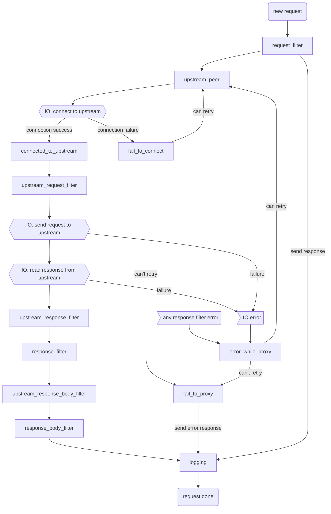

# 请求的生命周期：pingora-proxy 阶段和过滤器

## 简介
`pingora-proxy` `HTTP` 代理框架支持高可编程的代理行为。这通过允许用户将自定义逻辑注入到请求的不同阶段（阶段）中来实现。

## 代理的 HTTP 请求的生命周期
1. 代理的 HTTP 请求的生命周期从代理从**下游**（即客户端）读取请求标头开始。
2. 然后，代理连接到**上游**（即远程服务器）。如果有之前建立的[连接可复用](pooling_zh.md)，则跳过此步骤。
3. 接着，代理将请求头发送到上游。
4. 一旦请求标头发送完成，代理进入双工模式，同时代理：
   a. 上游响应（请求和报文）到下游
   b. 下游请求报文到上游（如果有）。
5. 一旦整个请求/响应完成，请求的生命周期就结束了。释放所有资源。下游连接和上游连接被回收以供复用（如果适用）。

## Pingora-proxy 阶段和过滤器
`Pingora-proxy` 允许用户在请求的生命周期中插入任意逻辑。

### 通用过滤器使用指南
* 大多数过滤器返回[`pingora_error::Result<_>`](errors_zh.md)。当返回值为`Result::Err`时，将调用`fail_to_proxy()`并终止请求。
* 大多数过滤器都是异步函数，这允许在过滤器中执行其他异步操作，如 IO。
* 可以定义每个请求的 `CTX` 对象，在同一请求中过滤器之间可以共享状态。所有过滤器对该对象具有可变访问权限。
* 大多数过滤器是可选的。
* `upstream_response_*_filter()` 和 `response_*_filter()` 之所以同时存在，是为了 HTTP 缓存集成的原因（仍在进行中）。

### `request_filter()`
每个请求的第一个阶段。

此阶段通常用于验证请求输入、速率限制和初始化上下文。

### `proxy_upstream_filter()`
此阶段确定我们是否应继续向上游提供响应。如果我们进行熔断，通常会返回 502，但可以实现不同的响应。

此阶段返回一个布尔值，确定我们是否应继续向上游或报错。

### `upstream_peer()`
此阶段决定连接到哪个上游（例如通过 DNS 查找或者哈希/轮询），以及如何连接到它。

此阶段返回一个 `Peer`，定义要连接的上游。实现此阶段是**必需的**。

### `connected_to_upstream()`
当上游成功连接时执行此阶段。

通常，此阶段用于记录目的。在此阶段报告连接信息，例如 `RTT` 和上游 `TLS` 密码。

### `fail_to_connect()`
`connected_to_upstream()` 的对应部分。如果连接到上游时遇到异常，则调用此阶段。

在此阶段，用户可以在 `Sentry`/`Prometheus`/异常日志中报告异常信息。用户还可以决定发生异常是否可以重试。

如果异常可以重试，则会再次调用`upstream_peer()`，在此情况下，用户可以决定是重试相同的上游还是故障转移到次要上游。

如果异常无法重试，则请求将终止。

### `upstream_request_filter()`
此阶段是在发送到上游之前修改请求的。

### `upstream_response_filter()/upstream_response_body_filter()`
此阶段在接收到上游响应头/报文后触发。

此阶段用于修改或处理上游响应头（或报文）以发送到下游。请注意，此阶段在 `HTTP` 缓存之前调用，因此在此处进行的任何更改都将影响存储在 `HTTP` 缓存中的响应。

### `response_filter()/response_body_filter()/response_trailer_filter()`
此阶段在准备将响应头/报文/尾部发送到下游后触发。

此阶段用于在发送到下游之前修改它们。

### `error_while_proxy()`
此阶段在向上游代理异常时触发，这是在连接建立之后。

此阶段可以决定是否重试请求，如果连接可复用且 `HTTP` 方法是幂等的。

### `fail_to_proxy()`
此阶段在上述任何阶段中遇到异常时调用。

此阶段通常用于异常日志记录和向下游报告异常。

### `logging()`
这是在请求完成（或出现异常）之后以及在其任何资源被释放之前运行的最后阶段。每个请求最终都会进入此最终阶段。

此阶段通常用于日志记录和请求后清理。

### `request_summary()`
这不是一个阶段，而是一个常用的回调。

每个到达`fail_to_proxy()`的异常都将自动记录在异常日志中。在记录异常时将调用`request_summary()`来转储有关请求的信息。

此回调返回一个字符串，允许用户自定义在异常日志中转储什么信息，以帮助跟踪和调试故障。

### `suppress_error_log()`
这也不是一个阶段，而是另一个回调。

`fail_to_proxy()` 中的异常将自动记录在异常日志中，但用户可能对每个异常都不感兴趣。例如，如果客户端早期断开连接，则会记录下游异常，但是如果用户主要关注观察上游问题，则这些异常可能会变得嘈杂。此回调可以检查异常并返回 true 或 false。如果为 true，则异常不会写入日志。

### 缓存过滤器

待文档化
