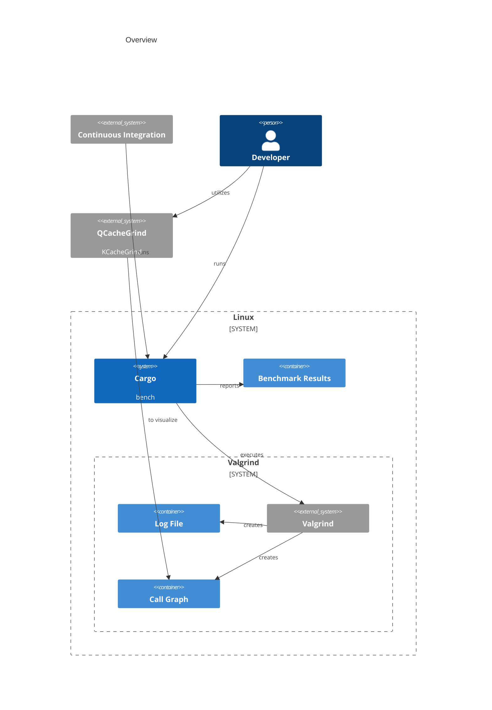
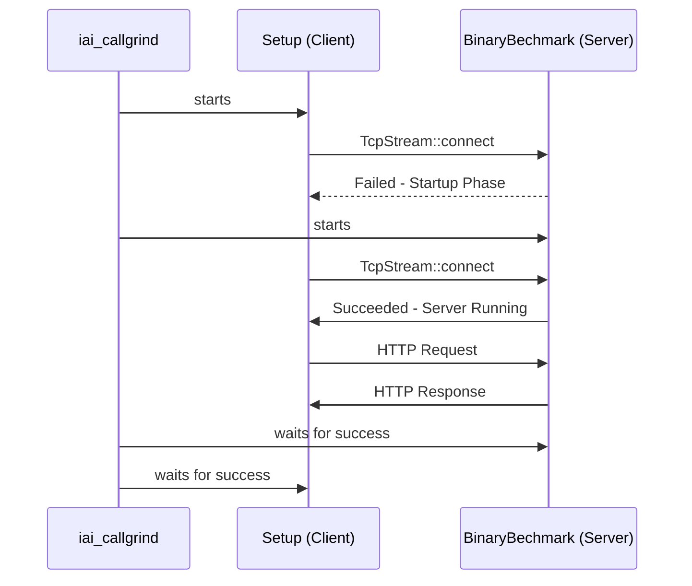

# TLS Benchmarks
The benchmarks are using [Valgrind](https://valgrind.org/) through the [iai_callgrind](https://docs.rs/iai-callgrind/latest/iai_callgrind/) benchmark framework.
For measuring performance the Valgrind tool [callgrind](https://valgrind.org/docs/manual/cl-manual.html) is used.



## Visualization
With [kcachegrind](https://github.com/KDE/kcachegrind)/[qcachegrind](https://github.com/KDE/kcachegrind) the call-graphs
can be interactively visualized and navigated.

[gprof2dot](https://github.com/jrfonseca/gprof2dot) and [graphviz](https://graphviz.org/) can create call-graph images.

```bash
gprof2dot -f callgrind *out | dot -T png -o out.png
```

The iai_callgrind default [Flamegrahps](https://docs.rs/iai-callgrind/latest/iai_callgrind/struct.FlamegraphConfig.html#impl-Default-for-FlamegraphConfig)
are activated and stored in [SVG](https://en.wikipedia.org/wiki/SVG) format next to the call-graph files. 


## Technical Details
The TLS Benchmarks are intended to capture full `connect/accept` cycles.  To benchmark such scenario it is required
to have some parallel processes running (`server/client`) while only one of them should be benchmarked.

### Challenges
pingora-core uses [tokio](https://tokio.rs/) as runtime and [pingora-core::server::Server](https://docs.rs/pingora-core/latest/pingora_core/server/struct.Server.html)
spawns threads when being setup.
This leads to implications on the benchmark process as multiple threads need to be covered.

As tokio is used and network requests are issued during the benchmarking the results will always have a certain variance.

To limit the variance impact the following pre-cautions where considered:
- running benchmarks (where possible) within a single thread and utilize tokio single-threaded runtime
- issuing multiple requests during benchmarking

### Scenario Setup
Within `pingora-core/examples/` the BinaryBenchmark Command executables for benchmarking are built using `dev-dependencies`.
The `pingora-core/benches/` contains the opposite side and the iai_callgrind definitions.

The benchmarked part (`server/client` executable) is built with `pingora-core`. The opposite part is built using
external components (`reqwest/axum`).

The `servers` are instantiated to accept `POST` requests and echo the transmitted bodies in the response.

The binaries (`bench_server/bench_client`) are launched through iai_callgrind as [BinaryBenchmark](https://docs.rs/iai-callgrind/latest/iai_callgrind/struct.BinaryBenchmark.html)
within `valgrind/callgrind`.
The BinaryBenchmark [setup](https://docs.rs/iai-callgrind/latest/iai_callgrind/struct.BinaryBenchmark.html#structfield.setup)
function is used to run the opposite part (`client/server`) of the benchmark in parallel.

For the server benchmark scenario the layout looks like:
- iai_callgrind starts the client on the setup
   - the client waits for a TCP connect before issuing the requests
- iai_callgrind launches the server within valgrind
- once the server is up the setup function client successfuly connects and starts to run the requests
- the server stops after a pre-configured period of time



For the client benchmark the setup is similar, but inverse as the server runs within the iai_callgrind setup function.

### Running
The benchmarks can be run using the following commands:
```bash
VERSION="$(cargo metadata --format-version=1 |\
  jq -r '.packages[] | select(.name == "iai-callgrind").version')"
cargo install iai-callgrind-runner --version "${VERSION}"

FEATURES="openssl"
cargo build --no-default-features --features "${FEATURES}" --release --examples
cargo bench --no-default-features --features "${FEATURES}" --package pingora-core --bench tls_acceptor -- --nocapture
cargo bench --no-default-features --features "${FEATURES}" --package pingora-core --bench tls_connector -- --nocapture
```

### Output
Generated benchmark files are located below `target/iai/`:
```
target/iai/
└── pingora-core   # <cargo-workspace>
    └── tls_acceptor   # <cargo-bench-name>
        └── tls_acceptor   # <iai-benchmark-group>
            └── bench_server.http_11_handshake_always   # <iai-benchmark-group>.<iai-benchmark-name>
                      ├── callgrind.bench_server.http_11_handshake_always.flamegraph.Ir.diff.old.svg
                      ├── callgrind.bench_server.http_11_handshake_always.flamegraph.Ir.old.svg
                      ├── callgrind.bench_server.http_11_handshake_always.flamegraph.Ir.svg
                      ├── callgrind.bench_server.http_11_handshake_always.log
                      ├── callgrind.bench_server.http_11_handshake_always.log.old
                      ├── callgrind.bench_server.http_11_handshake_always.out
                      └── callgrind.bench_server.http_11_handshake_always.out.old
```

### Parameters
Server and client benchmark are parameterized with the following options:
- client/session re-use
- HTTP version `1.1|2.0`
- number of requests
- request body size